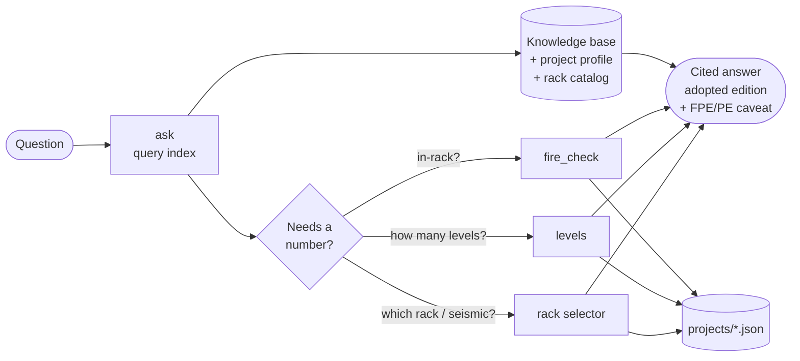

<div align="center">

# 🔥 nicet_agent

### Warehouse fire-protection & code reference assistant for Intralog

*Quick, cited answers on sprinklers, rack clearances, building/fire code and rack seismic — so a quick question doesn't wait days for a fire engineer.*

[](https://github.com/a-a-ronc/nicet_agent/actions/workflows/tests.yml)


</div>

> [!IMPORTANT]
> **This is a reference and triage tool, not a stamped engineering deliverable.** It tells you
> what the code says, which edition applies, what's likely required, and what's still
> unknown. Anything that drives a permit, procurement or construction must be reviewed by a
> licensed **fire protection engineer (FPE)** and/or **structural PE**.

---

## Contents

- [What it does](#what-it-does)
- [How it answers a question](#how-it-answers-a-question)
- [Quick start](#quick-start)
- [The tools](#the-tools)
- [Knowledge base](#knowledge-base)
- [Code editions: published vs. adopted](#code-editions-published-vs-adopted)
- [Project profiles](#project-profiles)
- [Rack catalog data](#rack-catalog-data)
- [Conventions baked in](#conventions-baked-in)
- [Testing](#testing)
- [Repository layout](#repository-layout)
- [Limitations & roadmap](#limitations--roadmap)

---

## What it does

| | |
|---|---|
| 📚 **Knowledge base** | Curated, cited notes on **NFPA 13**, **FM Global Data Sheets** (8-9, 8-1, 2-0, 1-2), **IBC/IFC** (incl. IFC Ch. 32 high-piled storage), **ANSI/RMI MH16.1** and **ASCE 7**, anchored to high-seismic US (CA/UT/WA). |
| 🔎 **Query index** | Ask a plain-English question → ranked KB sections with `file:line`, the best-matching line, and which tool gives the number. |
| 🧯 **In-rack triage** | "Do we need in-rack sprinklers — and why?" Open rack vs. solid shelving, ESFR envelope, 36 in. clearance, listings above 45 ft, in-rack level planning. |
| 📐 **Levels-that-fit** | Pitch, clear opening and levels for any load height, beam size and sprinkler choice. |
| 🏗️ **Rack selector** | Site → USGS ASCE 7 seismic → Cs/base shear → beam elevations → frame + beam pick by dealer priority (Interlake Mecalux › SpaceRAK › Hannibal/Nucor). |
| 🗂️ **Project memory** | One JSON profile per job holds site, heights, insurer, commodity, rack schema and open questions — every tool reads it. |

---

## How it answers a question



Every answer: **(1)** names the governing authority (FM vs. NFPA/AHJ), **(2)** cites the
**adopted** edition for the jurisdiction, **(3)** says which values must be read from a table
by the FPE, and **(4)** carries the review caveat.

---

## Quick start

```powershell
git clone https://github.com/a-a-ronc/nicet_agent.git
cd nicet_agent
python --version                     # 3.10+ ; no packages needed to run the tools

python -m rack_selector.ask "can we avoid in-rack sprinklers with wire decks?"
python -m rack_selector.fire_check --project projects/25-1642_new_balance_slc.json
```

Optional, for tests: `python -m pip install -r requirements-dev.txt` then `python -m pytest`.

---

## The tools

All four run from the repo root, accept `--json`, and (except `ask`) accept
`--project projects/<job>.json` to pre-fill inputs — explicit flags always win.

### 🔎 `ask` — query the knowledge base

```text
$ python -m rack_selector.ask "can we avoid in-rack sprinklers with wire decks and hand-stack cartons"

1. knowledge_base/nfpa13.md:164  —  NFPA 13 … > 6a. Open rack vs. solid shelving (decides whether in-rack is mandatory)
     line 171: open wire deck becomes "solid shelving" if hand-stacked cartons close off the flues.
2. projects/25-1642_new_balance_slc.json:58  —  Project 25-1642 — New Balance SLC … > Open questions
     line 61: - Wire deck open-area % and whether hand-stackers will hold the 3/6/3 in. flues.
3. rack_selector/methodology.md:84  —  … > 7. fire_check logic (in-rack triage)
     line 91: 4. **Open rack** if no shelving; shelf ≤ 20 ft²; or wire/slatted deck ≥ 50 % open with

For a numeric / project-specific answer, run:
  - python -m rack_selector.fire_check --project projects/<job>.json
```

BM25 ranking over **84 sections** — every KB heading, the tool docs, each project profile
(overview / open questions / history) and every dealer catalog family — with domain synonyms
(`in-rack ↔ IRAS`, `deck ↔ shelving`, `seismic ↔ SDC/ASCE`…), plural folding and a heading
boost. The index is cached in `knowledge_base/_index.json` and **rebuilds itself whenever any
source file changes** (`--rebuild` forces it).

### 🧯 `fire_check` — do we need in-rack sprinklers?

```text
$ python -m rack_selector.fire_check --project projects/25-1642_new_balance_slc.json --deck-open 60 --pitch 44 --levels 6

IN-RACK: LIKELY
  - Ceiling > 45 ft: NFPA 13 table ESFR is not available for ceiling-only; options are a
    specific-application listing or in-rack ('virtual floor').
SPECIFIC-APPLICATION CEILING-ONLY OPTIONS
  - Reliable P25 (K25.2 specific application, cULus): blocked: ceiling > 48 ft
IN-RACK LEVEL PLANNING
  - EC in-rack (K25.2EC pendent, NFPA 13-2019 §25.8.3) (max 30 ft vertical): levels 2
      virtual floor must be >= 5.0 ft (ceiling above it <= ESFR table ceiling)
```

Decision path: adopted editions → FM override → IFC Ch. 32 trigger → row type
(single/double/multiple) → **open rack vs. solid shelving** → ESFR ceiling-only envelope
(≤ 40 ft storage / ≤ 45 ft ceiling, 36 in. clearance) → specific-application listings
(Reliable P25, Viking VK514, FM K28) → in-rack level planning. Status is one of
**`REQUIRED` · `LIKELY` · `UNRESOLVED` · `POSSIBLY_AVOIDABLE`**, each with its reasons and citations.

### 📐 `levels` — how many levels fit?

```text
$ python -m rack_selector.levels --load-height 31.5 --beams 3.5,5 --max-top-beam-ft 26.5 --hole-pitch 2

  beam  in-rack  clear      pitch   opening beam lvls stor lvls  top of stor  headroom
  3.5"       no     6"      3'-6"     38.5"         7         8     27'-1.5"     24.0"
  3.5"      yes    12"      4'-0"     44.5"         6         7     26'-7.5"     30.0"
    5"       no     6"      3'-8"       39"         7         8     28'-3.5"     10.0"
    5"      yes    12"      4'-2"       45"         6         7     27'-7.5"     18.0"
```

Limit by sprinkler deflector (`--deflector-height-ft`, minus 36 in. ESFR / 18 in. standard),
top of storage, or frame height. Flags anything above the 40 ft ceiling-only ESFR storage limit.

### 🏗️ `rack_selector` — frames, beams, seismic

```text
$ python -m rack_selector --project projects/25-1642_new_balance_slc.json --levels 6 --shelf-load 1800 --ceiling-sprinkler esfr --hole-pitch 2

  Pitch: 42.0 in  | Clearance/level: 6 in  | Beam height: 3.66 in
  NFPA 36 in. top-of-storage-to-deflector check vs 588 in: OK
  BEAM : Interlake Mecalux 36E  3.656" face  @ 144"  cap 2,000 lb/pair  (util 90%, published)
  FRAME: Interlake Mecalux 3B77  3in, 15ga  depth [36, 42, 44, 48] in  cap 18,600 lb  (util 58%, published)
```

- **Seismic:** USGS web service, `--code-edition asce7-16` (UT/WA permits) or `asce7-22`;
  `--offline --sds --sd1 --s1 --sdc` when there's no internet. Cs per ASCE 7 §12.8
  (R = 6 down-aisle / 4 cross-aisle), base shear per bay per ANSI/RMI MH16.1.
- **Loads:** pallet mode (`--pallet-weight`, `--pallets-per-bay`) or hand-stack mode
  (`--shelf-load`, lb per level per bay).
- **Selection:** lightest sufficient beam/frame per dealer, then dealer priority; flags
  manufacturer rules (Interlake beams > 126 in need lateral bracing; > 90 in with decks need ties).

Full assumptions and limits: [`rack_selector/methodology.md`](rack_selector/methodology.md).

---

## Knowledge base

Start at [`knowledge_base/00_INDEX.md`](knowledge_base/00_INDEX.md) — the router.

| File | Covers |
|---|---|
| [`nfpa13.md`](knowledge_base/nfpa13.md) | Commodity classes, storage arrangements, CMDA/CMSA/ESFR, ESFR envelope & > 45 ft options, clearances, flue spaces, in-rack options, **open rack vs. solid shelving** |
| [`fm_global.md`](knowledge_base/fm_global.md) | DS 8-9, 8-1, 2-0, 1-2 — when FM governs and how it differs from NFPA |
| [`ibc_ifc.md`](knowledge_base/ibc_ifc.md) | Occupancy (S-1/S-2/H), allowable height & area, IFC Ch. 32 high-piled storage |
| [`seismic_rack_design.md`](knowledge_base/seismic_rack_design.md) | ANSI/RMI MH16.1, ASCE 7, SDC, anchorage, clearance conventions, dealer handling rules |
| [`commodity_quick_reference.md`](knowledge_base/commodity_quick_reference.md) | Cheat sheet — numbers worth memorizing and the decision order |
| [`adopted_codes_utah.md`](knowledge_base/adopted_codes_utah.md) | **Governing editions for Utah / Salt Lake City** |
| [`adopted_codes_ca_wa.md`](knowledge_base/adopted_codes_ca_wa.md) | California and Washington adopted editions |

---

## Code editions: published vs. adopted

The KB is written against the **latest published** standards. A permit is reviewed against
the edition the **jurisdiction has adopted**, which is usually older — the tools always report
the adopted one ([`adopted_codes.json`](rack_selector/data/adopted_codes.json)).

| Jurisdiction | NFPA 13 | IFC | IBC | ASCE 7 | Status |
|---|:-:|:-:|:-:|:-:|---|
| **Utah / Salt Lake City** | **2019** | **2021** | 2018 | **7-16** | ✅ confirmed (State Fire Marshal, eff. 2023-07-01) |
| California (2025 Title 24) | 2022 | 2024 | 2024 | 7-22 | ⚠️ partially verified (eff. 2026-01-01) |
| Washington | 2019 | 2021 | 2021 | 7-16 | ⚠️ partially verified (eff. 2024-03-15; 2024 codes pending) |
| *Latest published (reference)* | *2025* | *2024* | *2024* | *7-22* | — |

> [!NOTE]
> **FM Global-insured sites:** FM Data Sheets govern fire protection regardless of the
> adopted NFPA edition, and FM is generally more conservative. Always confirm the insurer first.

---

## Project profiles

Each job gets a JSON file in [`projects/`](projects/) (copy
[`_TEMPLATE.json`](projects/_TEMPLATE.json)). It records the **site & jurisdiction**,
**building / deflector heights**, **insurer**, **commodity**, **rack schema**, plus
**`open_questions`** and a running **`history`** of decisions. All tools read it with
`--project`, the query index searches it, and the agent updates it as facts come in.

**Active:** [`25-1642_new_balance_slc.json`](projects/25-1642_new_balance_slc.json) — New Balance
SLC hand-stack pick racking (copy of the Ontario, CA schema).

---

## Rack catalog data

[`rack_selector/data/rack_catalog.json`](rack_selector/data/rack_catalog.json) — gravity load
tables used for component selection.

| Dealer | Beams | Frames | Data |
|---|---|---|---|
| **Interlake Mecalux** | Step beams 27E – 65Q, 48 – 168 in | Welded teardrop IK025F – IK099F · bolted 3B77 – 5B122 | ✅ **Published** — Calculation Tables U02 (2014), MH16.1-2012 |
| **SpaceRAK** | Roll-formed 306M – 602M | Structural channel 335B – 454B | ✅ **Published** — 2018/2019 capacity charts |
| **Hannibal / Nucor** | Teardrop (4 sizes) | Roll-formed (3) | ⚠️ **Representative** — no public chart; request from Hannibal |

> [!WARNING]
> Gravity tables only. Seismic adequacy at the computed Cs needs the manufacturer's seismic
> calc and a PE. The Interlake bolted **3B82T** column mapping was inferred from PDF text
> extraction — verify against the printed table.

---

## Conventions baked in

| Rule | Value | Source |
|---|---|---|
| Load-handling clearance per level, **no** in-rack | **+ 6 in.** | Intralog convention |
| Load-handling clearance per level, **with** in-rack | **+ 12 in.** | Intralog convention |
| Top of storage → deflector, standard spray | ≥ 18 in. | NFPA 13 |
| Top of storage → deflector, **ESFR / CMSA** | **≥ 36 in.** | NFPA 13 §14.2.12 (2019+) |
| Ceiling-only ESFR, Class I–IV & cartoned unexpanded plastic | ≤ 40 ft storage / ≤ 45 ft ceiling | NFPA 13 Ch. 23 |
| Open rack | solid shelf ≤ 20 ft², or deck ≥ 50 % open **with flues maintained** | NFPA 13 Ch. 3 |
| High-piled storage trigger | > 12 ft (> 6 ft for Group A plastics *if the fire official requires*) | IFC §3202 / §3203.6 |

---

## Testing

```powershell
python -m pip install -r requirements-dev.txt
python -m pytest                                   # 158 pass, 3 live tests skipped
python -m coverage run -m pytest; python -m coverage report
$env:NICET_NETWORK="1"; python -m pytest -m network   # live USGS + geocoder smoke tests
```

**161 tests · 95 % line coverage**, plus CI on every push across **Ubuntu + Windows ×
Python 3.10 – 3.13** ([`.github/workflows/tests.yml`](.github/workflows/tests.yml), fails under 90 % coverage).

| Type | What it proves | Where |
|---|---|---|
| **Unit** | Seismic math (Cs bounds, Ie, period cap), clearance/pitch, conservative catalog lookups, level fitting, every fire_check rule | `test_seismic`, `test_clearance`, `test_catalog`, `test_levels`, `test_fire_check` |
| **Retrieval quality** | 30 realistic questions land in the top 3 (≥ 85 % at #1); every section retrievable by its own heading | `test_ask` |
| **Index completeness & freshness** | Every KB heading, project profile and catalog family is indexed; cache hits, stale rebuilds, corrupt-cache recovery | `test_ask` |
| **Data integrity** | Catalog capacities never rise with span; deeper beams never weaker; adopted-code ↔ ASCE 7 consistency; project schemas; every KB cross-reference resolves | `test_data_integrity` |
| **Integration** | Project profile → fire_check / levels / selector; hand-stack mode; ESFR clearance in layouts | `test_handstack_and_project`, `test_selector` |
| **Network (mocked)** | USGS 7-16 vs 7-22 endpoints & parameters, error statuses, ZIP/address geocoding, CLI failure handling — no internet needed | `test_network_mocked` |
| **End-to-end** | Each tool run as `python -m …` in a subprocess; JSON outputs; error exit codes | `test_cli_end_to_end` |
| **Windows console** | Output piped through **cp1252** doesn't crash on `→ ≥ ²` (regression-tested: fails without the fix) | `test_cli_end_to_end` |
| **Live smoke** *(opt-in)* | Real USGS + ZIP calls for Salt Lake City | `test_network_mocked -m network` |

> [!NOTE]
> What tests **can't** prove: that the engineering conclusions match a real FPE/PE design.
> The rules are sourced and cited, but validating against reviewed project designs is the
> next level of assurance (see roadmap).

---

## Repository layout

```text
nicet_agent/
├── CLAUDE.md                     # how the agent answers (routing, guardrails, tools)
├── README.md
├── knowledge_base/               # cited reference notes (+ generated _index.json)
│   ├── 00_INDEX.md               #   router — start here
│   ├── nfpa13.md · fm_global.md · ibc_ifc.md · seismic_rack_design.md
│   ├── commodity_quick_reference.md
│   └── adopted_codes_utah.md · adopted_codes_ca_wa.md
├── projects/                     # one JSON profile per job
│   ├── _TEMPLATE.json
│   └── 25-1642_new_balance_slc.json
├── rack_selector/                # the tools (stdlib only)
│   ├── ask.py                    #   query index
│   ├── fire_check.py             #   in-rack triage
│   ├── levels.py                 #   levels-that-fit
│   ├── cli.py · selector.py      #   rack selector
│   ├── seismic.py · geocode.py · catalog.py · clearance.py · project.py · _io.py
│   ├── data/                     #   rack_catalog.json · adopted_codes.json
│   ├── methodology.md · README.md
│   └── tests/                    #   161 tests
├── .github/workflows/tests.yml   # CI: Ubuntu + Windows × Py 3.10–3.13
├── pytest.ini · .coveragerc · requirements-dev.txt
```

---

## Limitations & roadmap

**Not covered today:** sprinkler densities / hydraulics (licensed table data), conventional
K8/K11.2 in-rack level spacing (read the NFPA 13 Ch. 25 figure), anchor/base-plate and
overstrength design, double-deep / push-back / drive-in / flow rack, and Hannibal published tables.

**Next up**

- [ ] Validate tool conclusions against FPE-reviewed project designs (golden cases)
- [ ] Hannibal / Nucor published load tables
- [ ] Anchor / base-plate + overstrength checks
- [ ] Push-back, drive-in, pallet-flow, double-deep configurations
- [ ] Verify CA / WA NFPA 13 editions; add more jurisdictions

<div align="center">
<sub>Built for Intralog · triage only — every permit or build decision goes through a licensed FPE / PE.</sub>
</div>
